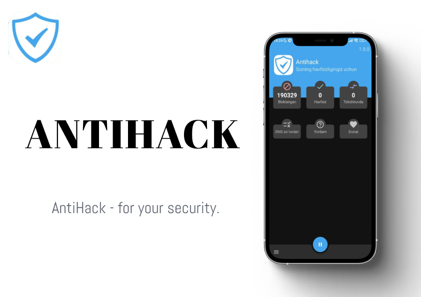

<h1 align="center">AntiHack </h1>
<h3 align="center">AntiHack - for your security.</h3>

Hacking are not blocked when on mobile data connection!
AdAway will not work reliably when on Mobile Networks like 3G. You can deactivate that proxy by going to your selected APN (On Android 4: Wireless and networks -> More… -> Mobile Networks -> Access Point Names) and remove the value in the proxy field.

Hacking in Chrome are not blocked!
Disable Chrome’s Data Compression Proxy.

Advertisements in Application XYZ are not blocked!
Follow this guide to find the corresponding hostnames and how to report them.

Application XYZ stopped working!
See this list of problematic apps for a workaround. If your app is not included fill a bug report and hope for help.

Back button in Android’s Browser stopped working!
Enable the local Webserver in AdAway’s preferences as a workaround.

Are there more hosts sources that can be used?
More Hosts sources can be found on the Wiki on Github.

Redirection Lists for blocked domains in China
Add Redirection Lists to your Hosts Sources to redirect blocked DNS requests to the correct IPs in China. This hosts source contains redirection rules for Google, Facebook, and other. (You need to enable “Allow redirection rules from Hosts Sources” in preferences).

More information?

<h3 align="left">Connect with me: https://t.me/mamurof</h3>

